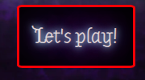

# Three In A Row

Three In A Row is a simple but fun site that allows two friends to relax and enjoy a fun game together. The aim of the game is to get three of your own symbols in a row, and each player is represented by either an "X" or an "O". When one of the players manages to get three in a row the game will, unless it ended in a draw, proclaim a winner. The game features fun sounds and can, through the "Let's play!-button" always be reset if so desired.

## Features

* The title
  - A unique and inviting title welcoming the players.

* The game board
  - A sleek and intuitive game board that makes the game clear and easy to understand.
  - One player will be represented by an "X" and the other by an "O".
  - A text below the board will inform the players whose turn it is as well as proclaim the winner.

* The background image
  - Unique image made by the author of this site.
  - Gives the site a unique and interesting look.

  

* The "Let's Play! button"
  - A button always present throughout the game. 
  - Lets the players restart the game whenever they feel like it.
  - Glows when the player hovers over it.

 

* Sounds
  - Sounds play whenever a player makes a move or whenever someone wins.

 

### Features left to implement

* Make "X" and "O" have different colors.

* Make the winning combinatio of cells glow.

## Testing

* The site has been tested on the following browsers: Firefox, Google Chrome and Microsoft Edge.
* I can confirm that the entire site is responsive and adapts to all common screen sizes.
* I can confirm that every element of the site is readable and easy to understand.

 

### Validator Testing

* HTML
  - No errors were returned when passing through the official [W3C HTML Validator](https://validator.w3.org/nu/?doc=https%3A%2F%2Fraluca59.github.io%2F-Three-in-a-row%2F).

* CSS
  - No errors were returned when passing through the official [W3C CSS Validator](https://jigsaw.w3.org/css-validator/validator?uri=https%3A%2F%2Fraluca59.github.io%2F-Three-in-a-row%2F&profile=css3svg&usermedium=all&warning=1&vextwarning=&lang=en).

* JS
  - No errors were returned when passing through the official [JSHint validator](https://jshint.com/).

* Lighthouse
  - I used Lighthouse in devtools to confirm that the accessibility and performance of the site is at an acceptable level.

    

### Unfixed bugs

* There are no unfixed bugs.

 

## Deployment

* The site was deployed to GitHub pages. To deploy one must follow these steps:
  1. Enter the GitHub repository.
  2. Find the "Settings" tab and click it.
  3. Find the "Pages" tab and click it.
  4. Find the "Select branch" drop-down menu under the "Branch" heading.
  5. Choose "main" in the drop-down menu and save.
  6. Wait a short while and refresh the page in order to receive a url and a link to the newly deployed site.

 

* The live link can be found [here](https://raluca59.github.io/-Three-in-a-row/)

 

## Credits

### Media

* The sounds were taken from [Mixkit](https://mixkit.co/free-sound-effects/).

